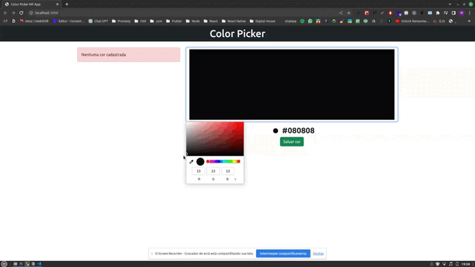

<h1 align="center">Color Picker MF App</h1>

<p align="center">
  <a href="#page_with_curl-sobre">Sobre</a>&nbsp;&nbsp;&nbsp;|&nbsp;&nbsp;&nbsp;
  <a href="#hammer-iniciando-mobile">Tecnologias</a>
  &nbsp;&nbsp;&nbsp;|&nbsp;&nbsp;&nbsp;
  <a href="#books-requisitos">Requisitos</a>&nbsp;&nbsp;&nbsp;|&nbsp;&nbsp;&nbsp;
  <a href="#rocket-começando">Começando</a>&nbsp;&nbsp;&nbsp;
</p>

<h1 align="center">
  
</h1>

## :page_with_curl: Sobre

Color Picker MF App é uma aplicação desenvolvida na arquitetura de microfrontend onde o usuário pode selecionar uma cor e essa cor é adicionada em uma lista de cores.

## :hammer: Tecnologias

Para a construção da aplicação, foram utilizadas as seguintes tecnologias:

- [React JS](https://react.dev/)
- [TypeScript](https://www.typescriptlang.org/)
- [Module Federation - Webpack](https://webpack.js.org/concepts/module-federation/)

## :rocket: Requisitos

- Ter [**Git**](https://git-scm.com/) para clonar o projeto.
- Ter [**Node.js**](https://nodejs.org/en/) instalado.

## :rocket: Começando

```bash
  # Clonar o projeto:
  $ https://github.com/brunowbbs/pick-color-microfrontend

  # Entrar nos diretórios e instalar as dependencias:
  $ yarn
```

## :iphone: Executando

```bash
  # Iniciar a aplicação:
  $ cd host && yarn start
```

Feito por Wesley Bruno 👋🏻 [Get in touch!](https://github.com/brunowbbs)
